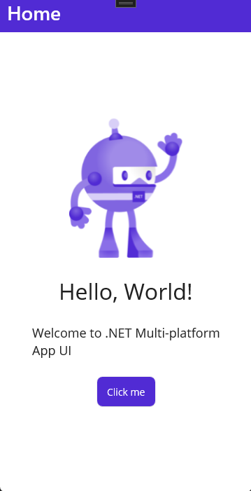

## AndroidAppDevelopment.FirstPart - Практическая работа №1

## AndroidAppDevelopment.SecondPart - Практическая работа №2

## AndroidAppDevelopment.ThirdPart - Практическая работа №3

## AndroidAppDevelopment.FourthPart - Практическая работа №4

## AndroidAppDevelopment.LastOnePart - Практическая работа №6

## AndroidAppDevelopment.LastPart - Практическая работа №7

## AndroidAppDevelopment.Sudoku - Дополнительное задание

