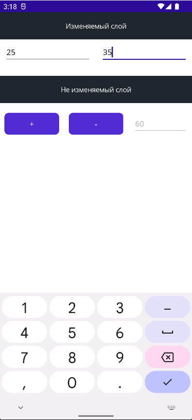
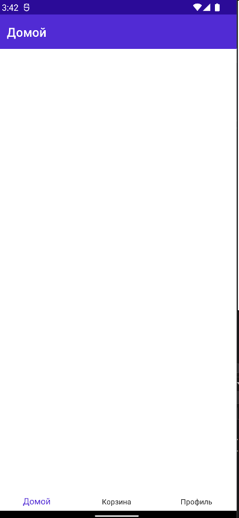
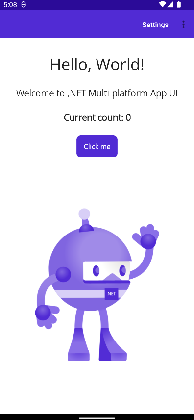
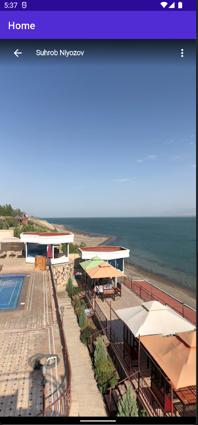
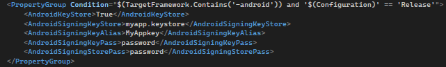

## AndroidAppDevelopment.FirstPart - Практическая работа №1

## AndroidAppDevelopment.SecondPart - Практическая работа №2

## AndroidAppDevelopment.ThirdPart - Практическая работа №3

## AndroidAppDevelopment.FourthPart - Практическая работа №4

## AndroidAppDevelopment.LastOnePart - Практическая работа №6

## AndroidAppDevelopment.LastPart - Практическая работа №7
Чтобы подписать приложение для Android, необходимо выполнить определенные настройки на уровне проекта. Для этого мы добавим набор данных, содержащихся в тегах конфигурации.
Перейдите к файлу ProjectName.csproj. Затем перейдите в конец этого файла, непосредственно перед концом тега </Project>, и вставьте следующий код:

## AndroidAppDevelopment.Sudoku - Дополнительное задание

